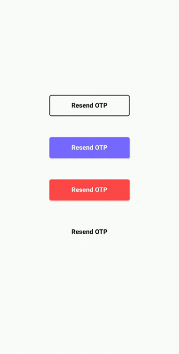
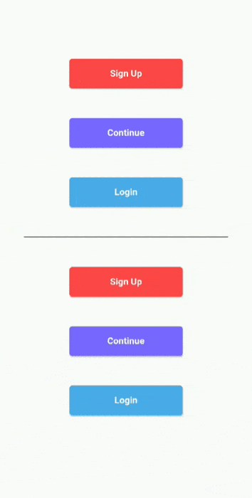

# Argon Buttons (Timer and Loading)

Create beautiful Loading and Timer buttons using Argon Buttons. No need to worry about handling animations or timers as this pakage does all the messy stuff for you.


# Getting Started

You basically have two widgets that you can use, **ArgonButton** and **ArgonTimerButton**. ArgonButton helps you create beautiful loading animation in your buttons. ArgonTimerButton helps you create timer buttons that you can use to handle stuff like "Resend OTP" => "Wait for 10 sec".

## Demo







## ArgonButton

ArgonButton is basically RaisedButton on steroids. That means that you can use the usual parameters that you use with RaisedButtons with a few extra functionalities.

Example:

```dart
ArgonButton(
  height: 50,
  width: 350,
  borderRadius: 5.0,
  color: Color(0xFF7866FE),
  child: Text(
    "Continue",
    style: TextStyle(
        color: Colors.white,
        fontSize: 18,
        fontWeight: FontWeight.w700
	),
  ),
  loader: Container(
    padding: EdgeInsets.all(10),
    child: SpinKitRotatingCircle(
      color: Colors.white,
      // size: loaderWidth ,
    ),
  ),
  onTap: (startLoading, stopLoading, btnState) {
  },
)
```
This creates a button that animates to a circular loader whenever we want to do a network request or any other task that takes some time to output the response.
Here I am using SpinKit for showing the rotating loader inside my button. You can use what ever you like.

We animate the button by using the parameters passed in **onTap** function. On Tap recieves 3 parameter: **startLoading(), stopLoading()  and btnState**

You can call the startLoading function to change the state of the button to **Busy** which will animate the button and show the loader. When you call the stopLoading function, the button goes to the norma(Idle) state. In the third parameter btnState you can actually check the current state of the button.

Using onTap:
```dart
ArgonButton(
[...]
onTap:(startLoading, stopLoading, btnState){
  if(btnState == ButtonState.Idle){
    startLoading();
    await doNetworkRequest();
    stopLoading();
  }
}
)
```

### Properties
- **roundLoadingShape**(Default  true) : When set to true, it uses borderRadius to creates a round button while in Busy/Loading state
- **width**: Width of the button when in Idle state
- **minWidth**: Width of the button when in Busy/Loading state. Default value is equal to height in order to create a completely round loading button
- **borderRadius**: Border Radius of the button
- **borderSide** : BorderSide in order to give border color and width to the button
- **child**: Contents of button when in Idle state
- **loader**: Contents of button when in Busy/Loading state
- **onTap**: (startLoading, stopLoading, btnState) : Function that is called when you click on the button


## ArgonTimerButton

ArgonTimerButton is similar to ArgonButton but it also has the functionality of working as a Timer button. You can not only give it a **initialTimer** value but also restart the timer with different countdown from the onTap function.

Example:

```dart
ArgonTimerButton(
  initialTimer: 10, // Optional
  height: 50,
  width: MediaQuery.of(context).size.width * 0.45,
  minWidth: MediaQuery.of(context).size.width * 0.30,
  color: Color(0xFF7866FE),
  borderRadius: 5.0,
  child: Text(
    "Resend OTP",
    style: TextStyle(
        color: Colors.black,
        fontSize: 18,
        fontWeight: FontWeight.w700
    ),
  ),
  loader: (timeLeft) {
    return Text(
      "Wait | $timeLeft",
      style: TextStyle(
          color: Colors.black,
          fontSize: 18,
          fontWeight: FontWeight.w700
        ),
    );
  },
  onTap: (startTimer, btnState) {
    if (btnState == ButtonState.Idle) {
      startTimer(20);
    }
  },
),
```
The onTap function recieves a **startTimer(int count)** function and a **btnState** variable. You can use the startTimer function and pass in the new countdown value to restart the counter. This could be very useful for Resend OTP button where after every click you want to reset the counter to a new value from the server.
The **loader** in this case is a button that recieves time left from the timer and has to return a widget which will be the child in the button.


### Properties
- **initialTimer** (Optional): it is a optional value given to start the timer when the widget is build
- **roundLoadingShape**(Default  true) : When set to true, it uses borderRadius to creates a round button while in Busy/Loading state
- **width**: Width of the button when in Idle state
- **minWidth**: Width of the button when in Busy/Loading state. Default value is equal to height in order to create a completely round loading button
- **borderRadius**: Border Radius of the button
- **borderSide** : BorderSide in order to give border color and width to the button
- **child**: Contents of button when in Idle state
- **loader**:  It is a function that recieves the left time as parameter and returns the contents of button when in Busy/Loading state
- **onTap**: (startTimer, btnState) : Function that is called when you click on the button


### More
- **duration**: Duration of the animation
- **curve**: Curve of animation
- **reverseCurve**: Curve of reverse animation